<!-- GENERATED by scripts/render_readme.py from profile.yaml — do not edit by hand -->

<picture>
  <source media="(prefers-color-scheme: dark)" srcset="./hero-dark.svg">
  <source media="(prefers-color-scheme: light)" srcset="./hero-light.svg">
  
</picture>

 

<picture>
  <source media="(prefers-color-scheme: dark)" srcset="./contrib-heatmap-dark.svg">
  <source media="(prefers-color-scheme: light)" srcset="./contrib-heatmap-light.svg">
  
</picture>

### About

Currently, I’m studying computer science and math at MIT. I continue to branch out and explore how advances in ML, computing, and artificial intelligence are changing the way we create problems. And I’ve only gotten started.

I consistently aim to create meaningful impact by applying analytical reasoning and critical thinking while remaining open to diverse perspectives. I'm curious about how ML & AI can improve productivity, globalize social connections, and determine what comes next. I'm always thinking, hence always iterating, building, and taking risks.

Reach out; I'd be more than happy to connect.

### Stack

<picture><source media="(prefers-color-scheme: dark)" srcset="./stack-languages-dark.svg"><source media="(prefers-color-scheme: light)" srcset="./stack-languages-light.svg"></picture>
<picture><source media="(prefers-color-scheme: dark)" srcset="./stack-ml-dark.svg"><source media="(prefers-color-scheme: light)" srcset="./stack-ml-light.svg"></picture>
<picture><source media="(prefers-color-scheme: dark)" srcset="./stack-web-dark.svg"><source media="(prefers-color-scheme: light)" srcset="./stack-web-light.svg"></picture>
<picture><source media="(prefers-color-scheme: dark)" srcset="./stack-cloud_tools-dark.svg"><source media="(prefers-color-scheme: light)" srcset="./stack-cloud_tools-light.svg"></picture>

### Projects

<a href="https://github.com/m1trn/Predictive-Model-of-Single-Celled-Genomics"><picture><source media="(prefers-color-scheme: dark)" srcset="./project-predictive-model-of-single-celled-genomics-dark.svg"><source media="(prefers-color-scheme: light)" srcset="./project-predictive-model-of-single-celled-genomics-light.svg"></picture></a>
<a href="https://github.com/m1trn/Java-UI-UX-Tic-Tac-Toe"><picture><source media="(prefers-color-scheme: dark)" srcset="./project-java-ui-ux-tic-tac-toe-dark.svg"><source media="(prefers-color-scheme: light)" srcset="./project-java-ui-ux-tic-tac-toe-light.svg"></picture></a>

### Activity

<picture>
  <source media="(prefers-color-scheme: dark)" srcset="./activity-dark.svg">
  <source media="(prefers-color-scheme: light)" srcset="./activity-light.svg">
  
</picture>

