<!-- GENERATED by scripts/render_readme.py from profile.yaml — do not edit by hand -->

<picture>
  <source media="(prefers-color-scheme: dark)" srcset="./hero-dark.svg">
  <source media="(prefers-color-scheme: light)" srcset="./hero-light.svg">
  
</picture>

 

<picture>
  <source media="(prefers-color-scheme: dark)" srcset="./contrib-heatmap-dark.svg">
  <source media="(prefers-color-scheme: light)" srcset="./contrib-heatmap-light.svg">
  
</picture>

 

<picture>
  <source media="(prefers-color-scheme: dark)" srcset="./about-dark.svg">
  <source media="(prefers-color-scheme: light)" srcset="./about-light.svg">
  
</picture>

<h3><code>m1trn@github ~ $ ls stack/</code></h3>

**Languages**&nbsp;     

**ML / Data**&nbsp;     

**Web**&nbsp;  

**Cloud & Tools**&nbsp;    

<h3><code>m1trn@github ~ $ ls projects/</code></h3>

<table><tr><td><a href="https://github.com/m1trn/Predictive-Model-of-Single-Celled-Genomics"><picture>
  <source media="(prefers-color-scheme: dark)" srcset="./project-predictive-model-of-single-celled-genomics-dark.svg">
  <source media="(prefers-color-scheme: light)" srcset="./project-predictive-model-of-single-celled-genomics-light.svg">
  
</picture></a></td><td><a href="https://github.com/m1trn/Java-UI-UX-Tic-Tac-Toe"><picture>
  <source media="(prefers-color-scheme: dark)" srcset="./project-java-ui-ux-tic-tac-toe-dark.svg">
  <source media="(prefers-color-scheme: light)" srcset="./project-java-ui-ux-tic-tac-toe-light.svg">
  
</picture></a></td></tr></table>

<h3><code>m1trn@github ~ $ git log</code></h3>

<picture>
  <source media="(prefers-color-scheme: dark)" srcset="./activity-dark.svg">
  <source media="(prefers-color-scheme: light)" srcset="./activity-light.svg">
  
</picture>

 

<picture>
  <source media="(prefers-color-scheme: dark)" srcset="./languages-dark.svg">
  <source media="(prefers-color-scheme: light)" srcset="./languages-light.svg">
  
</picture>

<h3><code>m1trn@github ~ $ cat contact.md</code></h3>

<a href="https://minhtrn.com"><picture>
  <source media="(prefers-color-scheme: dark)" srcset="./contact-website-dark.svg">
  <source media="(prefers-color-scheme: light)" srcset="./contact-website-light.svg">
  
</picture></a>&nbsp;&nbsp;<a href="https://www.linkedin.com/in/minhntrn/"><picture>
  <source media="(prefers-color-scheme: dark)" srcset="./contact-linkedin-dark.svg">
  <source media="(prefers-color-scheme: light)" srcset="./contact-linkedin-light.svg">
  
</picture></a>&nbsp;&nbsp;<a href="https://github.com/m1trn"><picture>
  <source media="(prefers-color-scheme: dark)" srcset="./contact-github-dark.svg">
  <source media="(prefers-color-scheme: light)" srcset="./contact-github-light.svg">
  
</picture></a>

 

generated from <code>profile.yaml</code> · refreshed daily by GitHub Actions · 2026-08-22

