<!-- GENERATED by scripts/render_readme.py from profile.yaml — do not edit by hand -->

<picture>
  <source media="(prefers-color-scheme: dark)" srcset="./hero-dark.svg">
  <source media="(prefers-color-scheme: light)" srcset="./hero-light.svg">
  
</picture>

 

<picture>
  <source media="(prefers-color-scheme: dark)" srcset="./contrib-heatmap-dark.svg">
  <source media="(prefers-color-scheme: light)" srcset="./contrib-heatmap-light.svg">
  
</picture>

### About

Currently, I’m studying computer science and math at MIT. I continue to branch out and explore how advances in ML, computing, and artificial intelligence are changing the way we create problems. And I’ve only gotten started.

I consistently aim to create meaningful impact by applying analytical reasoning and critical thinking while remaining open to diverse perspectives. I'm curious about how ML & AI can improve productivity, globalize social connections, and determine what comes next. I'm always thinking, hence always iterating, building, and taking risks.

Reach out; I'd be more than happy to connect.

### Stack

**Languages**&nbsp;     

**ML / Data**&nbsp;     

**Web**&nbsp;  

**Cloud & Tools**&nbsp;    

### Projects

| Project | Description | Stack | ★ |
|---|---|---|---|
| [Predictive Model of Single-Cell Genomics](https://github.com/m1trn/Predictive-Model-of-Single-Celled-Genomics) | Bilinear perturbation model with PCA-space residual correction to predict single-cell gene expression — Broad Obesity Challenge (CrunchDAO) | `python` `jupyter` `numpy` `scikit-learn` | 0 |
| [Java Tic-Tac-Toe](https://github.com/m1trn/Java-UI-UX-Tic-Tac-Toe) | Two-player Swing desktop game — JFrame/JButton grid, turn logic, win/draw detection | `java` `swing` `awt` | 0 |

### Activity

<picture>
  <source media="(prefers-color-scheme: dark)" srcset="./activity-dark.svg">
  <source media="(prefers-color-scheme: light)" srcset="./activity-light.svg">
  
</picture>

### Contact

